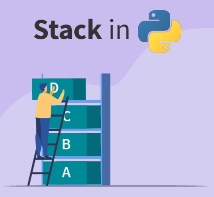

 

    
    <h3 align="center">Python Code Stack</h3>

<!-- Table of Contents -->

    
Table of Contents

    <ol>
        <li><a href="#about-the-project">About the Project</li>
        <li><a href="#features">Features</a></li>
        <li><a href="#acknowledgements">Acknowledgements</a></li>
    </ol>

<!-- About the project -->
## About The Project
A concept that executes stacked code or functions on the same piece of data. Just a fun python side project to do.

🚀 Mini Framework: Code Stacking
Define a Stack with an input variable.
Add functions (.add) that can depend on input and/or outputs of other functions.
Run the stack → it automatically resolves dependencies and executes in the right order.

The stack runs each stacked piece of code at the same time on the same bit of data (input_value).

<!-- Features -->
## Features

    - Define a Stack with an input variable.
    - Add functions (.add) that can depend on input and/or outputs of other functions.
    - Run the stack → it automatically resolves dependencies and executes in the right order.

    The stack runs each stacked piece of code at the same time on the same bit of data (input_value).

<!-- Acknowledgements -->
## Acknowledgements

This section is reserved for any resources I use while completing these projects.